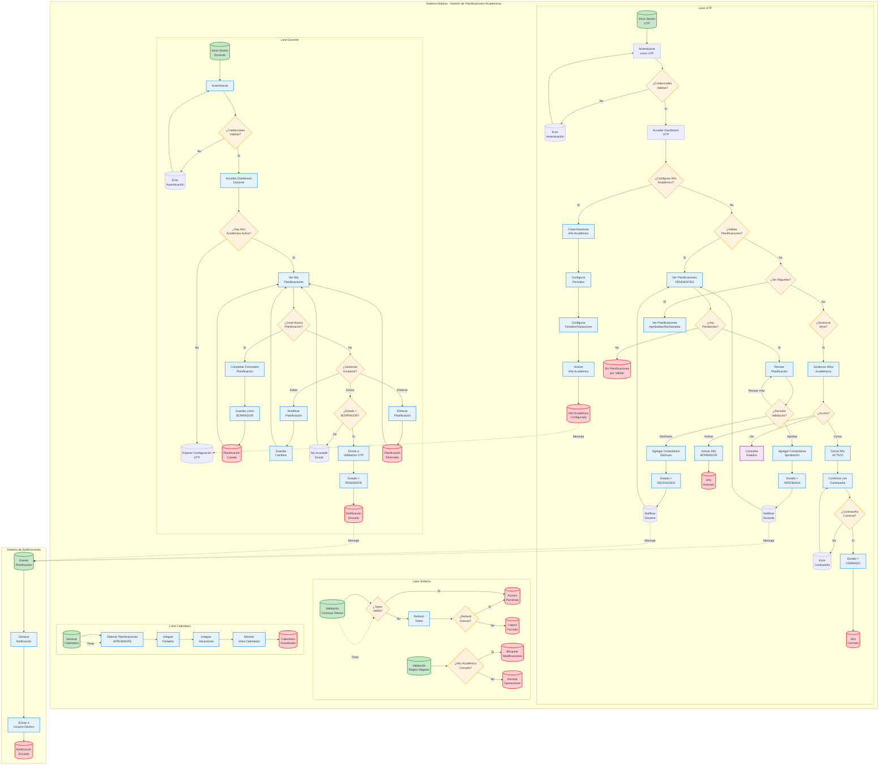

# Diagrama BPMN - Sistema de Planificaciones Académicas Didacta

## Descripción del Proceso BPMN

### **Pool Principal: Sistema Didacta**

#### **Lane Docente:**
- **Proceso de Autenticación y Acceso**
- **Gestión de Planificaciones** (Crear, Editar, Eliminar, Enviar)
- **Estados:** BORRADOR → PENDIENTE

#### **Lane UTP:**
- **Configuración de Años Académicos**
- **Validación de Planificaciones**
- **Gestión de Estados:** BORRADOR → ACTIVO → CERRADO
- **Aprobación/Rechazo:** PENDIENTE → APROBADA/RECHAZADA

#### **Lane Sistema:**
- **Validación Continua de Tokens**
- **Aplicación de Reglas de Negocio**
- **Control de Acceso por Estados**

#### **Lane Calendario:**
- **Generación Automática del Calendario**
- **Integración de Eventos Aprobados**
- **Visualización Consolidada**

### **Pool Externo: Sistema de Notificaciones**
- **Gestión de Mensajes entre Usuarios**
- **Notificaciones de Cambios de Estado**

### **Elementos BPMN Utilizados:**
- 🟢 **Eventos de Inicio** (círculos verdes)
- 🔴 **Eventos de Fin** (círculos rojos)
- 🔷 **Tareas** (rectángulos azules)
- 🔶 **Gateways de Decisión** (diamantes naranjas)
- 💜 **Subprocesos** (rectángulos morados)
- ⚡ **Eventos de Mensaje** (líneas punteadas)
- ⏱️ **Eventos de Timer** (activación automática)