# Diagrama BPMN Estándar - Sistema de Planificaciones Académicas Didacta

```mermaid
graph TB
    %% Pool: Sistema de Planificaciones Académicas
    subgraph Pool1["🏊‍♂️ Sistema de Planificaciones Académicas"]
        
        %% Lane: Docente
        subgraph Lane1["👨‍🏫 Lane: Docente"]
            %% Eventos de Inicio
            Start1(("Necesidad de<br/>Planificar"))
            
            %% Tareas
            Task1["Autenticarse<br/>en Sistema"]
            Task2["Verificar Año<br/>Académico"]
            Task3["Crear<br/>Planificación"]
            Task4["Completar<br/>Formulario"]
            Task5["Guardar como<br/>Borrador"]
            Task6["Enviar a<br/>Validación"]
            
            %% Gateways
            Gateway1{"¿Autenticación<br/>Exitosa?"}
            Gateway2{"¿Año Académico<br/>Activo?"}
            Gateway3{"¿Planificación<br/>Completa?"}
            Gateway4{"¿Enviar a<br/>UTP?"}
            
            %% Eventos Intermedios
            Event1[("Esperando<br/>Configuración")]
            Event2[("Planificación<br/>Guardada")]
            
            %% Eventos de Fin
            End1(("Planificación<br/>Enviada"))
            End2(("Proceso<br/>Cancelado"))
            
            %% Flujo Lane Docente
            Start1 --> Task1
            Task1 --> Gateway1
            Gateway1 -->|Sí| Task2
            Gateway1 -->|No| End2
            
            Task2 --> Gateway2
            Gateway2 -->|Sí| Task3
            Gateway2 -->|No| Event1
            
            Task3 --> Task4
            Task4 --> Gateway3
            Gateway3 -->|Sí| Task5
            Gateway3 -->|No| Task4
            
            Task5 --> Event2
            Event2 --> Gateway4
            Gateway4 -->|Sí| Task6
            Gateway4 -->|No| Task3
            
            Task6 --> End1
        end
        
        %% Lane: UTP (Unidad Técnico Pedagógica)
        subgraph Lane2["👩‍💼 Lane: UTP"]
            %% Eventos de Inicio
            Start2(("Configurar<br/>Sistema"))
            Start3(("Validar<br/>Planificación"))
            
            %% Tareas UTP
            Task10["Crear Año<br/>Académico"]
            Task11["Configurar<br/>Períodos"]
            Task12["Configurar<br/>Feriados"]
            Task13["Activar<br/>Año"]
            Task14["Revisar<br/>Planificación"]
            Task15["Agregar<br/>Comentarios"]
            Task16["Aprobar<br/>Planificación"]
            Task17["Rechazar<br/>Planificación"]
            
            %% Gateways UTP
            Gateway10{"¿Configuración<br/>Completa?"}
            Gateway11{"¿Planificación<br/>Válida?"}
            Gateway12{"¿Aprobar o<br/>Rechazar?"}
            
            %% Eventos Intermedios UTP
            Event10[("Año Académico<br/>Configurado")]
            Event11[("Decisión<br/>Tomada")]
            
            %% Eventos de Fin UTP
            End10(("Sistema<br/>Listo"))
            End11(("Planificación<br/>Aprobada"))
            End12(("Planificación<br/>Rechazada"))
            
            %% Flujo Lane UTP
            Start2 --> Task10
            Task10 --> Task11
            Task11 --> Task12
            Task12 --> Gateway10
            Gateway10 -->|Sí| Task13
            Gateway10 -->|No| Task11
            
            Task13 --> Event10
            Event10 --> End10
            
            Start3 --> Task14
            Task14 --> Gateway11
            Gateway11 -->|Sí| Gateway12
            Gateway11 -->|No| Task15
            
            Task15 --> Gateway12
            Gateway12 -->|Aprobar| Task16
            Gateway12 -->|Rechazar| Task17
            
            Task16 --> Event11
            Task17 --> Event11
            Event11 --> End11
            Event11 --> End12
        end
        
        %% Lane: Sistema Automático
        subgraph Lane3["🤖 Lane: Sistema"]
            %% Eventos de Inicio Sistema
            StartSys(("Token<br/>Expirado"))
            StartSys2(("Generar<br/>Calendario"))
            
            %% Tareas Sistema
            TaskSys1["Validar<br/>Token"]
            TaskSys2["Refresh<br/>Token"]
            TaskSys3["Obtener<br/>Planificaciones"]
            TaskSys4["Integrar<br/>Feriados"]
            TaskSys5["Generar<br/>Vista"]
            
            %% Gateway Sistema
            GatewaySys1{"¿Token<br/>Válido?"}
            
            %% Eventos Sistema
            EventSys1[("Token<br/>Renovado")]
            
            %% Eventos Fin Sistema
            EndSys1(("Acceso<br/>Denegado"))
            EndSys2(("Calendario<br/>Generado"))
            
            %% Flujo Sistema
            StartSys --> TaskSys1
            TaskSys1 --> GatewaySys1
            GatewaySys1 -->|No| TaskSys2
            GatewaySys1 -->|Sí| EventSys1
            
            TaskSys2 --> EventSys1
            EventSys1 --> EndSys1
            
            StartSys2 --> TaskSys3
            TaskSys3 --> TaskSys4
            TaskSys4 --> TaskSys5
            TaskSys5 --> EndSys2
        end
    end
    
    %% Pool Externo: Notificaciones
    subgraph Pool2["📧 Pool: Sistema de Notificaciones"]
        subgraph Lane4["📬 Lane: Mensajería"]
            StartNot(("Evento de<br/>Notificación"))
            TaskNot1["Generar<br/>Mensaje"]
            TaskNot2["Enviar<br/>Notificación"]
            EndNot(("Notificación<br/>Enviada"))
            
            StartNot --> TaskNot1
            TaskNot1 --> TaskNot2
            TaskNot2 --> EndNot
        end
    end
    
    %% Flujos de Mensaje entre Pools
    End1 -.->|"📨 Mensaje:<br/>Nueva Planificación"| Start3
    Event10 -.->|"📨 Mensaje:<br/>Sistema Listo"| Event1
    End11 -.->|"📨 Mensaje:<br/>Aprobación"| StartNot
    End12 -.->|"📨 Mensaje:<br/>Rechazo"| StartNot
    
    %% Estilos BPMN Estándar
    classDef startEvent fill:#c8e6c9,stroke:#4caf50,stroke-width:3px,color:#000
    classDef endEvent fill:#ffcdd2,stroke:#f44336,stroke-width:3px,color:#000
    classDef task fill:#e3f2fd,stroke:#2196f3,stroke-width:2px,color:#000
    classDef gateway fill:#fff3e0,stroke:#ff9800,stroke-width:2px,color:#000
    classDef intermediateEvent fill:#f3e5f5,stroke:#9c27b0,stroke-width:2px,color:#000
    classDef pool fill:#e8f5e8,stroke:#2e7d32,stroke-width:3px,color:#000
    
    %% Aplicar Estilos
    class Start1,Start2,Start3,StartSys,StartSys2,StartNot startEvent
    class End1,End2,End10,End11,End12,EndSys1,EndSys2,EndNot endEvent
    class Task1,Task2,Task3,Task4,Task5,Task6,Task10,Task11,Task12,Task13,Task14,Task15,Task16,Task17,TaskSys1,TaskSys2,TaskSys3,TaskSys4,TaskSys5,TaskNot1,TaskNot2 task
    class Gateway1,Gateway2,Gateway3,Gateway4,Gateway10,Gateway11,Gateway12,GatewaySys1 gateway
    class Event1,Event2,Event10,Event11,EventSys1 intermediateEvent
```

## Elementos BPMN Estándar Implementados:

### **🏊‍♂️ Pools (Participantes):**
- **Pool 1**: Sistema de Planificaciones Académicas
- **Pool 2**: Sistema de Notificaciones (externo)

### **🏃‍♀️ Lanes (Responsabilidades):**
- **Lane Docente**: Procesos del usuario docente
- **Lane UTP**: Procesos del coordinador académico
- **Lane Sistema**: Procesos automáticos
- **Lane Mensajería**: Notificaciones externas

### **⚫ Eventos (círculos):**
- **🟢 Eventos de Inicio**: Triggers que inician procesos
- **🟣 Eventos Intermedios**: Puntos de espera o captura
- **🔴 Eventos de Fin**: Terminación de procesos

### **📋 Actividades (rectángulos):**
- **Tareas**: Trabajo realizado por un participante
- **Subprocesos**: Actividades complejas (si aplica)

### **💎 Gateways (diamantes):**
- **Exclusivos**: Decisiones únicas (XOR)
- **Paralelos**: Flujos simultáneos (AND)
- **Inclusivos**: Múltiples opciones (OR)

### **📨 Flujos de Mensaje:**
- **Líneas punteadas**: Comunicación entre pools
- **Etiquetas**: Descripción del mensaje

### **📏 Flujos de Secuencia:**
- **Líneas sólidas**: Orden de ejecución dentro del pool
- **Tokens**: Indican el flujo de control

Este diagrama ahora sigue las **especificaciones BPMN 2.0** oficiales y puede ser interpretado por cualquier herramienta que soporte el estándar BPMN.