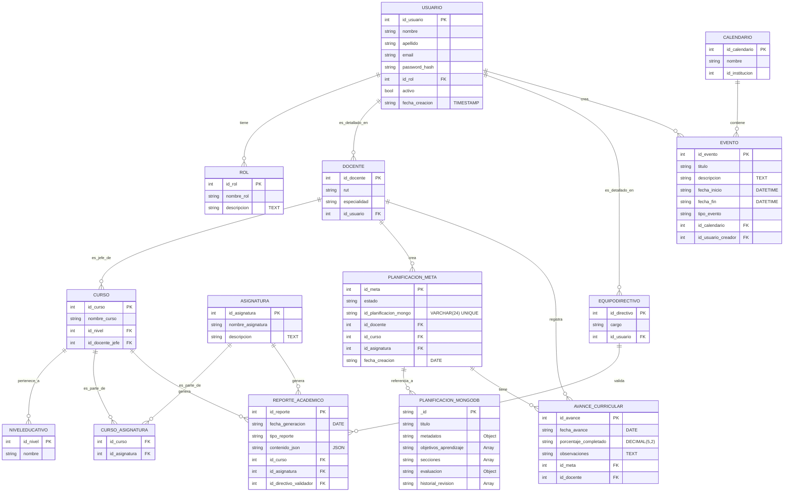

```mermaid
erDiagram
    %% Entidades de la Base de Datos Relacional (MySQL)

    USUARIO {
        int id_usuario PK
        string nombre
        string apellido
        string email
        string password_hash
        int id_rol FK
        bool activo
        string fecha_creacion "TIMESTAMP"
    }

    ROL {
        int id_rol PK
        string nombre_rol
        string descripcion "TEXT"
    }

    DOCENTE {
        int id_docente PK
        string rut
        string especialidad
        int id_usuario FK
    }

    EQUIPODIRECTIVO {
        int id_directivo PK
        string cargo
        int id_usuario FK
    }

    CALENDARIO {
        int id_calendario PK
        string nombre
        int id_institucion
    }

    EVENTO {
        int id_evento PK
        string titulo
        string descripcion "TEXT"
        string fecha_inicio "DATETIME"
        string fecha_fin "DATETIME"
        string tipo_evento
        int id_calendario FK
        int id_usuario_creador FK
    }

    ASIGNATURA {
        int id_asignatura PK
        string nombre_asignatura
        string descripcion "TEXT"
    }

    CURSO {
        int id_curso PK
        string nombre_curso
        int id_nivel FK
        int id_docente_jefe FK
    }

    NIVELEDUCATIVO {
        int id_nivel PK
        string nombre
    }

    CURSO_ASIGNATURA {
        int id_curso FK
        int id_asignatura FK
    }

    PLANIFICACION_META {
        int id_meta PK
        string estado
        string id_planificacion_mongo "VARCHAR(24) UNIQUE"
        int id_docente FK
        int id_curso FK
        int id_asignatura FK
        string fecha_creacion "DATE"
    }

    AVANCE_CURRICULAR {
        int id_avance PK
        string fecha_avance "DATE"
        string porcentaje_completado "DECIMAL(5,2)"
        string observaciones "TEXT"
        int id_meta FK
        int id_docente FK
    }

    REPORTE_ACADEMICO {
        int id_reporte PK
        string fecha_generacion "DATE"
        string tipo_reporte
        string contenido_json "JSON"
        int id_curso FK
        int id_asignatura FK
        int id_directivo_validador FK
    }

    %% Entidad de la Base de Datos NoSQL (MongoDB)

    PLANIFICACION_MONGODB {
        string _id PK
        string titulo
        string metadatos "Object"
        string objetivos_aprendizaje "Array"
        string secciones "Array"
        string evaluacion "Object"
        string historial_revision "Array"
    }

    %% Relaciones

    USUARIO ||--o{ ROL : tiene
    USUARIO ||--o{ DOCENTE : es_detallado_en
    USUARIO ||--o{ EQUIPODIRECTIVO : es_detallado_en

    DOCENTE ||--o{ CURSO : es_jefe_de
    DOCENTE ||--o{ PLANIFICACION_META : crea
    DOCENTE ||--o{ AVANCE_CURRICULAR : registra

    EQUIPODIRECTIVO ||--o{ REPORTE_ACADEMICO : valida

    CALENDARIO ||--o{ EVENTO : contiene
    USUARIO ||--o{ EVENTO : crea

    CURSO ||--o{ NIVELEDUCATIVO : pertenece_a
    CURSO ||--o{ CURSO_ASIGNATURA : es_parte_de
    ASIGNATURA ||--o{ CURSO_ASIGNATURA : es_parte_de

    PLANIFICACION_META ||--o{ PLANIFICACION_MONGODB : referencia_a
    PLANIFICACION_META ||--o{ AVANCE_CURRICULAR : tiene

    CURSO ||--o{ REPORTE_ACADEMICO : genera
    ASIGNATURA ||--o{ REPORTE_ACADEMICO : genera
```