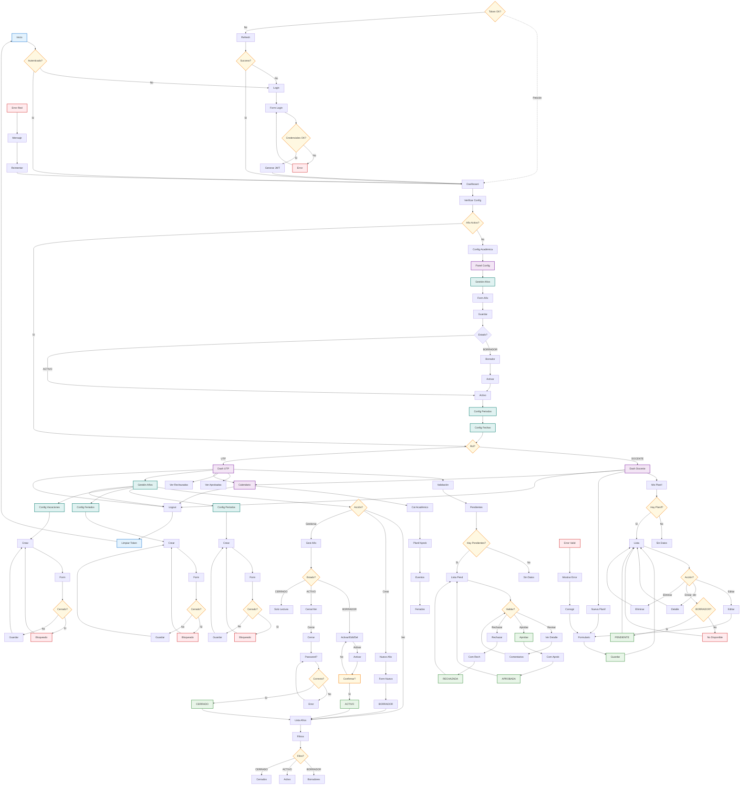

```mermaid
graph TD
    %% Inicio y Autenticación
    A[Inicio] --> B{Autenticado?}
    B -->|No| C[Login]
    B -->|Sí| D[Dashboard]
    
    C --> C1[Form Login]
    C1 --> C2{Credenciales OK?}
    C2 -->|No| C3[Error]
    C3 --> C1
    C2 -->|Sí| C4[Generar JWT]
    C4 --> D
    
    %% Verificación Académica
    D --> D1[Verificar Config]
    D1 --> D2{Año Activo?}
    D2 -->|No| D3[Config Académica]
    D2 -->|Sí| D4{Rol?}
    
    %% Config Académica
    D3 --> E[Panel Config]
    E --> E1[Gestión Años]
    E1 --> E2[Form Año]
    E2 --> E3[Guardar]
    E3 --> E4{Estado?}
    E4 -->|BORRADOR| E5[Borrador]
    E4 -->|ACTIVO| E6[Activo]
    E5 --> E8[Activar]
    E8 --> E6
    E6 --> E9[Config Periodos]
    E9 --> E10[Config Fechas]
    E10 --> D4
    
    %% Dashboard Docente
    D4 -->|DOCENTE| F[Dash Docente]
    F --> F1[Mis Planif]
    F1 --> F2{Hay Planif?}
    F2 -->|No| F3[Sin Datos]
    F2 -->|Sí| F4[Lista]
    
    F --> F5[Nueva Planif]
    F5 --> F6[Formulario]
    F6 --> F7[Guardar]
    F7 --> F4
    
    F4 --> F9{Acción?}
    F9 -->|Editar| F10[Editar]
    F9 -->|Ver| F11[Detalle]
    F9 -->|Enviar| F12{BORRADOR?}
    F9 -->|Eliminar| F13[Eliminar]
    
    F10 --> F6
    F11 --> F4
    F12 -->|No| F15[No Disponible]
    F12 -->|Sí| F16[PENDIENTE]
    F15 --> F4
    F16 --> F4
    F13 --> F4
    
    %% Dashboard UTP
    D4 -->|UTP| G[Dash UTP]
    G --> G1[Validación]
    G1 --> G2[Pendientes]
    G2 --> G3{Hay Pendientes?}
    G3 -->|No| G4[Sin Datos]
    G3 -->|Sí| G5[Lista Pend]
    
    G5 --> G6{Validar?}
    G6 -->|Revisar| G7[Ver Detalle]
    G6 -->|Aprobar| G8[Aprobar]
    G6 -->|Rechazar| G9[Rechazar]
    
    G7 --> G10[Comentarios]
    G10 --> G6
    
    G8 --> G11[Com Aprob]
    G11 --> G12[APROBADA]
    G12 --> G5
    
    G9 --> G15[Com Rech]
    G15 --> G16[RECHAZADA]
    G16 --> G5
    
    %% Otras funciones UTP
    G --> G18[Ver Aprobadas]
    G --> G20[Ver Rechazadas]
    
    %% Calendario
    G --> H[Calendario]
    F --> H
    H --> H1[Cal Académico]
    H1 --> H2[Planif Aprob]
    H2 --> H3[Eventos]
    H3 --> H4[Feriados]
    
    %% Gestión Años (UTP)
    G --> I[Gestión Años]
    I --> I1{Acción?}
    I1 -->|Ver| I2[Lista Años]
    I1 -->|Crear| I3[Nuevo Año]
    I1 -->|Gestionar| I4[Gest Año]
    
    I2 --> I5[Filtros]
    I5 --> I6{Filtro?}
    I6 -->|BORRADOR| I7[Borradores]
    I6 -->|ACTIVO| I8[Activo]
    I6 -->|CERRADO| I9[Cerrados]
    
    I3 --> I10[Form Nuevo]
    I10 --> I11[BORRADOR]
    I11 --> I2
    
    I4 --> I12{Estado?}
    I12 -->|BORRADOR| I13[Activar/Edit/Del]
    I12 -->|ACTIVO| I14[Cerrar/Ver]
    I12 -->|CERRADO| I15[Solo Lectura]
    
    %% Activar Año
    I13 -->|Activar| I16[Activar]
    I16 --> I17[Confirmar?]
    I17 -->|Sí| I18[ACTIVO]
    I17 -->|No| I13
    I18 --> I2
    
    %% Cerrar Año
    I14 -->|Cerrar| I20[Cerrar]
    I20 --> I21[Password?]
    I21 --> I22{Correcto?}
    I22 -->|No| I23[Error]
    I22 -->|Sí| I24[CERRADO]
    I23 --> I21
    I24 --> I2
    
    %% Configuraciones
    I --> J[Config Periodos]
    J --> J1[Crear]
    J1 --> J2[Form]
    J2 --> J3{Cerrado?}
    J3 -->|Sí| J4[Bloqueado]
    J3 -->|No| J5[Guardar]
    J4 --> J1
    J5 --> J1
    
    I --> K[Config Feriados]
    K --> K1[Crear]
    K1 --> K2[Form]
    K2 --> K3{Cerrado?}
    K3 -->|Sí| K4[Bloqueado]
    K3 -->|No| K5[Guardar]
    K4 --> K1
    K5 --> K1
    
    I --> L[Config Vacaciones]
    L --> L1[Crear]
    L1 --> L2[Form]
    L2 --> L3{Cerrado?}
    L3 -->|Sí| L4[Bloqueado]
    L3 -->|No| L5[Guardar]
    L4 --> L1
    L5 --> L1
    
    %% Logout
    F --> M[Logout]
    G --> M
    H --> M
    I --> M
    M --> M1[Limpiar Token]
    M1 --> A
    
    %% Validaciones
    N{Token OK?} -.->|Petición| D
    N -->|No| O[Refresh]
    O --> P{Success?}
    P -->|No| C
    P -->|Sí| D
    
    %% Errores
    Q[Error Red] --> Q1[Mensaje]
    Q1 --> Q2[Reintentar]
    Q2 --> D
    
    R[Error Valid] --> R1[Mostrar Error]
    R1 --> R2[Corregir]
    R2 --> F6
    
    %% Estilos optimizados
    classDef inicio fill:#e3f2fd,stroke:#1976d2,stroke-width:2px
    classDef proceso fill:#f3e5f5,stroke:#7b1fa2,stroke-width:2px
    classDef decision fill:#fff8e1,stroke:#f57c00,stroke-width:2px
    classDef error fill:#ffebee,stroke:#d32f2f,stroke-width:2px
    classDef exito fill:#e8f5e8,stroke:#388e3c,stroke-width:2px
    classDef config fill:#e0f2f1,stroke:#00796b,stroke-width:2px
    
    class A,M1 inicio
    class F,G,E,H proceso
    class B,C2,D2,D4,F2,F9,F12,G3,G6,I1,I6,I12,I17,I22,J3,K3,L3,N,P decision
    class C3,F15,J4,K4,L4,Q,R error
    class F16,G12,G16,I18,I24,F7,G8 exito
    class I,J,K,L,E1,E9,E10 config
```