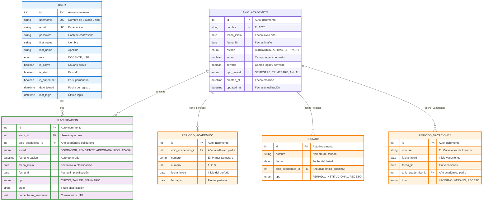
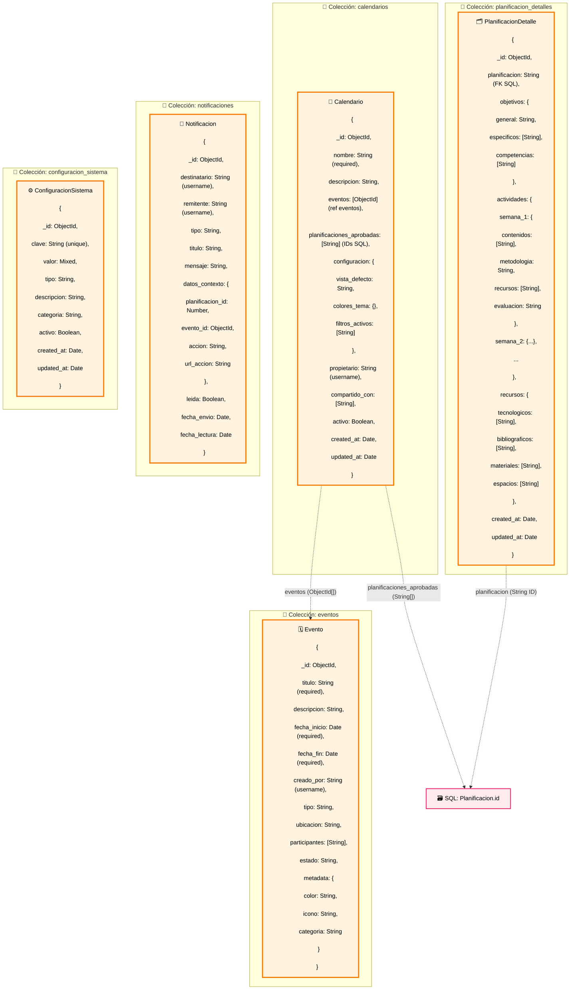
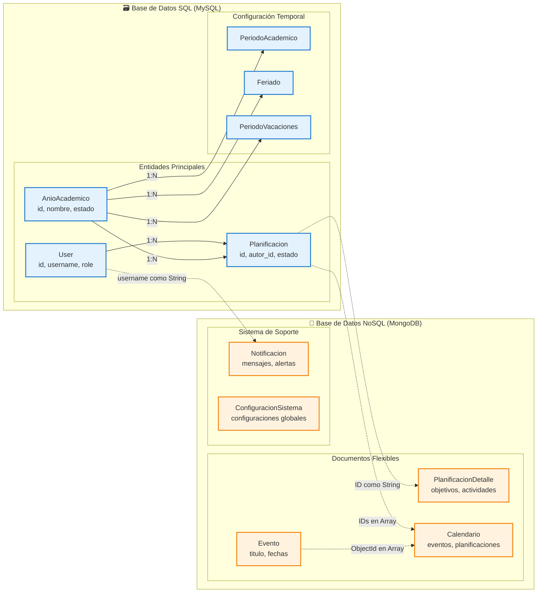

# Diagramas de Modelado de Datos - Proyecto Didacta

## 1. Base de Datos SQL (MySQL/PostgreSQL) - Entidades Relacionales

## 2. Base de Datos NoSQL (MongoDB) - Documentos

## 3. Modelo Híbrido - Relación entre SQL y NoSQL

## Descripción del Modelo de Datos

### **🗃️ SQL (Relacional) - Estructura y Transacciones**
- **Entidades normalizadas** con integridad referencial
- **Transacciones ACID** para operaciones críticas
- **Consultas complejas** con JOINs para reportes
- **Validaciones estrictas** de estado y permisos

### **📄 NoSQL (Documentos) - Flexibilidad y Escalabilidad**
- **Documentos JSON** para datos variables y anidados
- **Esquemas flexibles** para contenido educativo
- **Consultas rápidas** por índices en MongoDB
- **Escalabilidad horizontal** para grandes volúmenes

### **🔗 Arquitectura Híbrida**
- **SQL**: Datos estructurados, usuarios, planificaciones básicas
- **NoSQL**: Contenido detallado, eventos, configuraciones
- **Referencias cruzadas** mediante IDs y usernames
- **Consistencia eventual** entre ambas bases